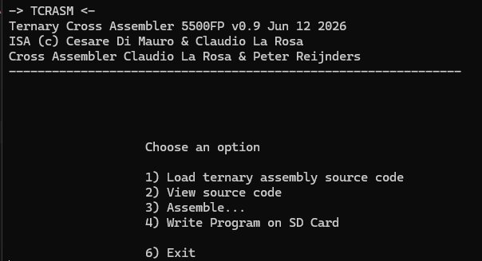
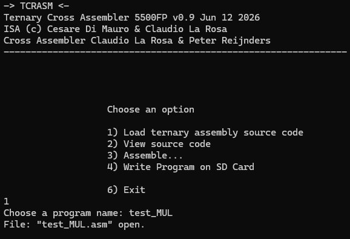
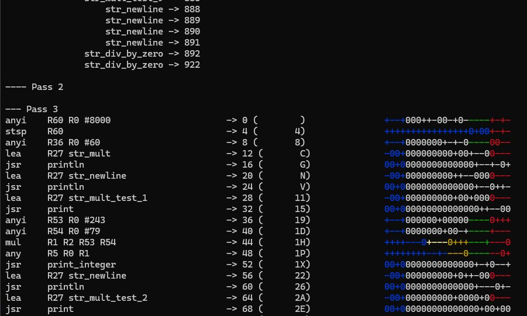
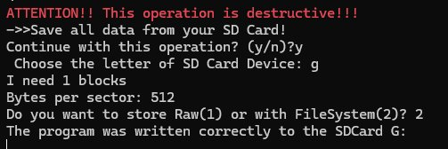

# CrossASM_5500FP

**Cross-assembler for the 5500FP, a 24-trit balanced-ternary RISC processor.**

CrossASM (also known by its acronym **TCRASM**, *Ternary CRoss ASseMbler*) is a
Windows tool that takes assembly source code written for the 5500FP instruction
set and produces a binary program image that can be loaded onto the 5500FP
development board via SD card.

## Authors and credits

- **Instruction Set Architecture (5500FP ISA)** — © Cesare Di Mauro & Claudio La Rosa
- **Cross Assembler** — Claudio La Rosa & Peter Reijnders

## Repository contents

- `CrossASM.exe` — the pre-built Windows executable of the assembler
- `CONFIG/` — configuration files used by CrossASM at runtime

## System requirements

CrossASM is a native Windows application. It runs on standard Windows 10 and
Windows 11 installations.

> **Runtime dependency** — `CrossASM.exe` requires the Microsoft Visual C++
> Redistributable (x64). The runtime is typically present on machines with
> Microsoft Visual Studio installed; on systems where it is not available, it
> can be obtained from the
> [official Microsoft distribution](https://aka.ms/vs/17/release/vc_redist.x64.exe).

## Quick tour

CrossASM is an interactive, menu-driven program. It takes no command-line
arguments: simply launch `CrossASM.exe` from a working directory that contains
the source file(s) you wish to assemble.

### Main menu

On startup, the program prints a banner with version information and presents
the main menu:

The available options are:

| Option | Action                                |
|--------|---------------------------------------|
| 1      | Load ternary assembly source code     |
| 2      | View source code                      |
| 3      | Assemble...                           |
| 4      | Write Program on SD Card              |
| 6      | Exit                                  |

### Loading a source file

Selecting option **1** prompts for the name of the source file to load. Type
the filename **without the `.asm` extension**:

### Assembling

Selecting option **3** runs the assembler over the loaded source. The output
includes a full listing in which each instruction is shown together with its
address, decimal/heptavigesimal encoding, and a colour-coded balanced-ternary
representation:

### Writing to SD card

Selecting option **4** writes the assembled program to a removable SD card,
ready to be inserted into the GargantuRAM board on the development unit. The
write procedure prompts for the SD card drive letter and for the desired
storage mode (`Raw` or `FileSystem`); for normal operation, choose
`FileSystem (2)`.

A complete, end-to-end walk-through of the assemble-and-load workflow is given
in the example programs repository (see below).

## Example programs

The companion repository
[5500_example_code](https://github.com/MOS5500/5500_example_code)
contains a collection of assembly example programs for the 5500FP, together
with shared `include/` and `COMMON/` files. Its README documents the complete
workflow from source file to running program on the development board, and is
the recommended starting point for new users.

## Further information

The 5500FP processor and its system documentation are archived on Zenodo:
[doi:10.5281/zenodo.18881738](https://doi.org/10.5281/zenodo.18881738).
